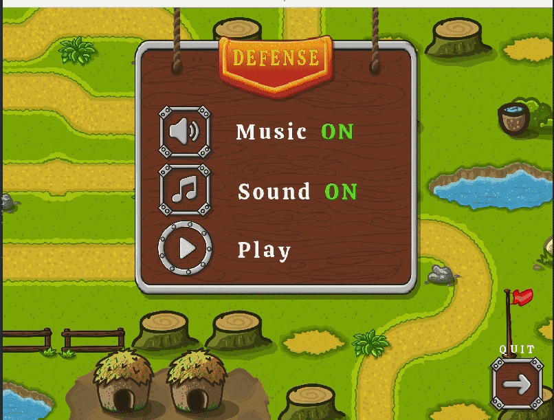
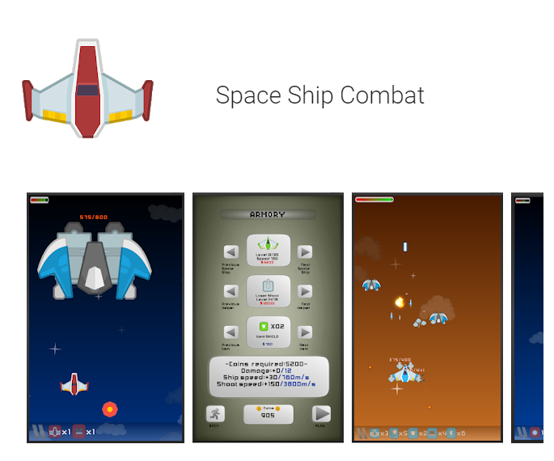

# Mini MBM — Lightweight 2D/3D Game Engine

[](https://mbm-documentation.readthedocs.io/en/latest/)
[](LICENSE.md)

> **[Versão em Português (BR)](#mini-mbm--motor-gráfico-leve-2d3d)** — Role para baixo para a documentação em português.

---

**Mini MBM** is a lightweight, cross-platform game engine designed to make **2D game development** simple and productive while providing the foundations for 3D as well. It offers a set of renderable object types (sprites, textures, meshes, particles, tile maps, fonts, and more), a flexible **plugin architecture**, multiple **render backends**, and an optional **Lua 5.4 scripting layer** that dramatically speeds up development.

The engine runs on **Windows**, **Linux**, **macOS**, and **Android**, and ships with a collection of powerful **Lua-based editor tools** (built with [Dear ImGui](https://github.com/ocornut/imgui)) for creating sprites, fonts, shaders, particles, tile maps, scenes, and asset packages — all producing optimized binary formats ready for your game.

📖 **Online documentation (work in progress):** <https://mbm-documentation.readthedocs.io/en/latest/>

---

## Games Made with Mini MBM

<table>
  <tr>
    <td align="center"><strong>Tower Defense Monster</strong></td>
    <td align="center"><strong>Spaceship Combat</strong></td>
  </tr>
  <tr>
    <td align="center"></td>
    <td align="center"></td>
  </tr>
  <tr>
    <td align="center">
      <a href="https://play.google.com/store/apps/details?id=com.mini.mbm.towerdefense">Google Play</a> · <a href="https://mbm.itch.io/tower-defense-monster">itch.io</a>
    </td>
    <td align="center">
      <a href="https://play.google.com/store/apps/details?id=com.mini.mbm.spaceshipcombat">Google Play</a>
    </td>
  </tr>
</table>

---

## Table of Contents

- [Quick Start](#quick-start)
- [Features at a Glance](#features-at-a-glance)
- [Architecture Overview](#architecture-overview)
  - [Core Classes](#core-classes)
  - [Render Pipeline](#render-pipeline)
- [Renderable Types (RENDERIZABLE)](#renderable-types-renderizable)
- [Custom Binary Formats](#custom-binary-formats)
- [Audio Backends & Supported File Formats](#audio-backends--supported-file-formats)
- [Render Backends](#render-backends)
- [Lua Scripting Interface](#lua-scripting-interface)
  - [Scene Lifecycle (Lua)](#scene-lifecycle-lua)
  - [Lua Wrappers for Renderable Types](#lua-wrappers-for-renderable-types)
  - [The `mbm` Namespace](#the-mbm-namespace)
- [Editor Tools](#editor-tools)
- [Plugin System](#plugin-system)
- [Building the Engine](#building-the-engine)
  - [Prerequisites](#prerequisites)
  - [Linux (CMake)](#linux-cmake)
  - [Windows (Visual Studio)](#windows-visual-studio)
  - [Android (CMake + NDK)](#android-cmake--ndk)
  - [macOS (CMake)](#macos-cmake)
  - [iOS (Metal, Xcode)](#ios-metal-xcode)
  - [CMake Option Flags](#cmake-option-flags)
- [Project Structure](#project-structure)
- [Third-Party Libraries](#third-party-libraries)
- [License](#license)

---

## Quick Start

This section gets you from zero to a running application in minutes. Choose **Lua mode** (recommended for fast iteration) or **C++ mode** (full low-level control).

### Option A: Lua Mode (Recommended)

**1. Build the engine with Lua support:**

```bash
mkdir build && cd build
cmake .. -DPLAT=Linux -DUSE_ALL=1 -DAUDIO=audiere -DCMAKE_BUILD_TYPE=Debug
make -j8;
```

**2. Create your game script** (e.g. `my_game.lua`):

```lua
local player

function onInitScene()
    -- Create a sprite in 2D world space
    player = sprite:new('2dw')
    if player:load('hero.spt') then
        print('Sprite loaded!')
    end
    player.x = 400
    player.y = 300

    -- Custom properties — Lua lets you attach any data
    player.life  = 100
    player.speed = 3
end

function loop(delta)
    -- move right each frame (delta-time multiplied)
    player:move(player.speed, 0)
end

function onKeyDown(keyCode)
    if keyCode == 27 then  -- ESC
        mbm.quit()
    end
end
```

**3. Run it:**

```bash
# From the build output directory
./mini-mbm --scene ../my_game.lua
```

Or launch the engine without arguments — a **launcher dialog** will appear where you can pick any of the built-in editors or browse to your own script.

### Option B: C++ Mode

**1. Build the engine (Lua not required):**

```bash
mkdir build && cd build
cmake .. -DPLAT=Linux -DCMAKE_BUILD_TYPE=Debug -DAUDIO=audiere
make -j$(nproc)
```

**2. Create your scene and game class:**

```cpp
// my-scene.h
#include <core_mbm/scene.h>
#include <core_mbm/core-manager.h>
#include <core_mbm/device.h>

class MY_SCENE : public mbm::SCENE {
public:
    void startLoading() override { /* show loading screen */ }
    void endLoading()   override { /* loading done */ }

    void init() override {
        // Set up camera
        mbm::DEVICE* device = mbm::DEVICE::getInstance();
        device->camera.position = mbm::VEC3(0, 0, -500);
        device->camera.focus    = mbm::VEC3(0, 0, 0);
    }

    void logic() override {
        // Game logic — called every frame
    }

    void onKeyDown(int key) override {
        if (key == 27) mbm::DEVICE::quit();  // ESC
    }

    // Input callbacks (implement as needed):
    void onTouchDown(int btn, float x, float y) override {}
    void onTouchUp(int btn, float x, float y)   override {}
    void onTouchMove(int btn, float x, float y) override {}
    void onKeyUp(int key) override {}
    void onFinalizeScene() override {}
};

class GAME : public mbm::CORE_MANAGER {
public:
    MY_SCENE myScene;
    GAME()  { setScene(&myScene); }
    ~GAME() { mbm::DEVICE::quit(); }
};
```

```cpp
// main.cpp
#include "my-scene.h"

int main() {
    GAME game;
    if (game.initGraphics("My First Game"))
        return game.loop(false, true);
    return -1;
}
```

**3. Build and run** — link against the engine library and launch your executable.

---

### Option C: iOS (Metal, Xcode)

The iOS port uses UIKit + Metal.  It requires **Xcode 15+** with the iOS SDK installed.

**1. Generate an Xcode project** (run once, from the repo root):

```bash
mkdir -p build && cd build
cmake .. \
      -DPLAT=iOS \
      -DUSE_ALL=1 \
      -DMBM_ENABLE_MESH_LEGACY_V7=1 \
      -DAUDIO=avfoundation \
      -DCMAKE_BUILD_TYPE=Debug \
      -G Xcode
```

**2a. Build via the command line** (iOS Simulator, no signing required):

```bash
# List available simulators first:
xcodebuild -project build/mini-mbm.xcodeproj -scheme mini-mbm -showdestinations | grep Simulator

# Build (replace name/OS with one from the list above)
xcodebuild -project build/mini-mbm.xcodeproj \
           -scheme mini-mbm \
           -destination "platform=iOS Simulator,name=iPhone 17,OS=26.1" \
           -configuration Debug \
           build 2>&1 | grep -E "error:|BUILD (SUCCEEDED|FAILED)"
```

**2b. Build via the Xcode IDE:**

1. Open the project: `open build/mini-mbm.xcodeproj`
2. In the toolbar, click the **scheme selector** (shows `mini-mbm`) — keep it as-is.
3. Click the **destination selector** next to it → choose a Simulator (e.g. *iPhone 17 (iOS 26.1)*).
4. Press **⌘B** (Product → Build).
5. Errors appear in the **Issue Navigator** (⌘5 / triangle icon on the left sidebar).

**3. Deploy to a physical device** (requires an Apple Developer account):

1. Connect your iPhone/iPad.
2. In Xcode → **Signing & Capabilities** tab → set **Team** and **Bundle Identifier**.
3. Select your device in the destination selector.
4. Press **⌘R** to build and run.

**4. Place your Lua scripts** in the app bundle under `Resources/`.  The engine entry
point is `Resources/main.lua`.

> **Notes:**
> - All plugins are **statically linked** on iOS (App Store sandbox forbids dynamic loading).
> - The launcher dialog is disabled on iOS; the engine launches `main.lua` directly.
> - File dialogs (`openFileDialog` / `saveFileDialog`) return `nullptr` on iOS.
> - Touch events are routed via UIKit (`onTouchDown/Move/Up`); mouse events are not used.
> - Orientation is locked to **landscape** by default (edit `Info.plist` and
>   `MetalViewController` to add portrait support).

---

## Features at a Glance

| Category | Highlights |
|---|---|
| **Rendering** | 13+ renderable types (sprites, meshes, textures, particles, tiles, fonts, shapes, …) with frustum culling, z-ordering, and blend modes |
| **Backends** | OpenGL ES 2.0 (Windows, Linux, Android), DirectX 9 (Windows), Dummy (headless), Metal (macOS). Vulkan planned |
| **Scripting** | Optional Lua 5.4 integration with full C++ type bindings |
| **Animation** | 7 animation modes (paused, growing, loop, decreasing, recursive, …) with per-frame shader effects |
| **Physics** | Box2D 2.4.1 (2D), LiquidFun 2.3.1 (fluids), Bullet 2.84 (3D) — all as optional plugins |
| **Audio** | Multi-backend: AVFoundation + OGG/stb_vorbis (macOS), PortAudio (Linux), Audiere / DirectSound8 (Windows), JNI (Android) |
| **GUI** | Dear ImGui plugin with Lua bindings — powers all built-in editors |
| **Editors** | Sprite Maker, Font Maker, Scene Editor 2D, Shader Editor, Particle Editor, Texture Packer, Tilemap Editor, Physics Editor, Mesh Debug, Asset Packager |
| **Platforms** | Windows, Linux, macOS, Android, iOS |
| **Camera** | 2D/3D camera with projection/view matrices, billboard, azimuth, pixel-perfect mode |
| **Shaders** | Custom FX system with per-variable min/max animation, PS + VS support |
| **Security** | AES encryption for scripts and assets (PlusAES) |
| **Formats** | Custom binary formats: `.msh` (mesh), `.spt` (sprite), `.fnt` (font), `.tile` (tile map), `.ptl` (particle). Compressed images (miniz), SQLite3 asset packages |

---

## Architecture Overview

### Core Classes

The engine is built around three central classes:

```
┌─────────────────────────────────────────────────┐
│  CORE_MANAGER (the engine runner)               │
│  ├── Owns DEVICE (singleton)                    │
│  ├── Manages the main loop: update → render     │
│  ├── Plugin system: addPlugin(PLUGIN*)          │
│  ├── Input event queue (thread-safe)            │
│  └── Scene management: setScene(SCENE*)         │
│                                                 │
│  DEVICE (singleton — DEVICE::getInstance())     │
│  ├── Back buffer & CAMERA                       │
│  ├── Render lists: 3D, 2D-world, 2D-screen,     │
│  │   render-to-texture                          │
│  ├── Frustum culling (FRUSTUM)                  │
│  ├── Collision detection (AABB 2D/3D)           │
│  ├── Coordinate transforms & ray casting        │
│  ├── Z-order control (ORDER_RENDER)             │
│  ├── Shader config loader (SHADER_CFG_LOADER)   │
│  └── FPS / delta / timers (TIME_CONTROL)        │
│                                                 │
│  SCENE (user-implemented per game screen)       │
│  ├── init(), logic(), startLoading()            │
│  ├── Input callbacks (touch, key, joystick)     │
│  └── Scene transitions via nextScene pointer    │
└─────────────────────────────────────────────────┘
```

**In C++ mode**, you subclass `mbm::CORE_MANAGER` (your game) and `mbm::SCENE` (each game screen), then call `initGraphics()` + `loop()`:

```cpp
#include <core_mbm/core-manager.h>

class MyScene : public mbm::SCENE {
    void init() override { /* load assets */ }
    void logic() override { /* game logic */ }
    // ... input callbacks
};

class MyGame : public mbm::CORE_MANAGER {
public:
    MyGame() { setScene(new MyScene()); }
};

int main() {
    MyGame game;
    game.initGraphics("My Game");
    const bool singleLoop    = false;
    const bool doSwapBuffers = true;
    game.loop(singleLoop, doSwapBuffers);
}
```

**In Lua mode**, the engine provides `mbm::LUA_MANAGER` which handles scene loading from Lua scripts — no C++ subclassing needed for game logic.

### Render Pipeline

Each frame, `CORE_MANAGER` executes:

1. **`update()`** — process input events, run `SCENE::logic()`, update physics & audio
2. **`renderToTargets()`** — render all `RENDER_2_TEXTURE` objects to their FBOs
3. **`prepareRender3d()` / `prepareRender2d()`** — frustum culling pass
4. **`render()`** — draw 3D objects, then 2D-world objects, then 2D-screen objects (respecting z-order)
5. **`swapBuffers()`** — present to screen

---

## Renderable Types (RENDERIZABLE)

All visible objects in the engine inherit from `mbm::RENDERIZABLE` (defined in `include/core_mbm/renderizable.h`). Each type has a `TYPE_CLASS` identifier and provides `render()`, `isOnFrustum()`, `onRestoreDevice()`, and animation support.

| Type | Class | Description |
|---|---|---|
| **Sprite** | `SPRITE` | Animated 2D sprite with frame-based animation. Supports 7 animation modes, per-frame shader effects, and physics shapes. The primary type for 2D games. Uses `.spt` format. |
| **Texture View** | `TEXTURE_VIEW` | Renders a standalone texture (PNG, BMP) as a textured quad. Simple, non-animated image display. |
| **Mesh** | `MESH` | Loads and renders 3D/2D meshes from the engine's custom `.msh` binary format. Supports normals, UVs, and shader effects. |
| **Background** | `BACKGROUND` | Full-screen or scaled background image. Can also render text/fonts as backgrounds. |
| **GIF View** | `GIF_VIEW` | Multi-frame animated GIF viewer. Plays through GIF frames automatically. |
| **Text** | `TEXT_DRAW` | Bitmap font text rendering with alignment, per-character animation, color, and shader effects. Uses `.fnt` format (converted from TTF). |
| **Shape Mesh** | `SHAPE_MESH` | Procedural geometry: circles, rectangles, triangles, custom indexed polygons, and dynamic vertex buffers. |
| **Line Mesh** | `LINE_MESH` | Line-based rendering for debug visualization, bounding box display, and wireframe overlays. |
| **Particle** | `PARTICLE` | GPU particle system with multi-stage control, custom shader operators, and configurable emitters. Uses `.ptl` format. |
| **Steered Particle** | `STEERED_PARTICLE` | Force-controlled particle system with groups — designed for fluids and steering behaviors (integrates with LiquidFun). |
| **Render-to-Texture** | `RENDER_2_TEXTURE` | Off-screen render target with its own 2D/3D camera. Can export to PNG. Used for post-processing, minimaps, mirrors, etc. |
| **Tile** | `TILE` | Tile-map renderer with multiple layers, brick IDs, per-tile operations, and scrolling. Uses `.tile` format. |
| **Tile Object** | `TILE_OBJ` | Individual tile object within a tile map layer. |

**Intermediate / specialized types:**
- `RENDERIZABLE_TO_TARGET` — base class for render-to-texture targets
- `HMD` — VR Head-Mounted Display (inherits `RENDER_2_TEXTURE`)
- `TILE_EDITOR` — tile editing subclass (used by the Tiled plugin)

All renderable types (except `TILE_OBJ`) also inherit from `ANIMATION_MANAGER`, providing built-in animation support with 7 modes: *Paused*, *Growing*, *Growing-Loop*, *Decreasing*, *Decreasing-Loop*, *Recursive*, and *Recursive-Loop*.

---

## Custom Binary Formats

The engine uses its own optimized binary formats for game assets. These are **not** generic file formats — they are generated by the engine's [editor tools](#editor-tools) and loaded directly at runtime for maximum performance.

| Extension | Name | Description | Generated by |
|---|---|---|---|
| `.msh` | Mesh | 3D or 2D mesh data (vertices, normals, UVs, indices) | Mesh Debug tool / external pipeline |
| `.spt` | Sprite | Animated sprite with frames, animation sequences, and optional physics shapes | Sprite Maker |
| `.fnt` | Font | Bitmap font converted from TrueType (`.ttf`) files | Font Maker |
| `.tile` | Tile Map | Tile-based level data with layers, brick IDs, and tile sets | Tilemap Editor |
| `.ptl` | Particle | Multi-stage particle system configuration (emitters, forces, colors, lifetimes) | Particle Editor |

> **Note:** You may encounter `.mbm` files in older parts of the codebase. This was the original format used in the very early stages of engine development and is being phased out in favor of the type-specific extensions listed above.

---

## Audio Backends & Supported File Formats

The audio backend is selected at **compile time** via the `-DAUDIO=<backend>` CMake flag. Each platform has a default.

| Platform | Default Backend | CMake Flag |
|---|---|---|
| macOS | AVFoundation | `-DAUDIO=avfoundation` |
| Linux | PortAudio | `-DAUDIO=portaudio` |
| Windows | Audiere | `-DAUDIO=audiere` |
| Android | JNI (SoundPool) | `-DAUDIO=jni` |
| All | None (silent) | `-DAUDIO=none` |

### Supported File Formats by Platform

| Format | macOS | Linux | Windows | Android | Notes |
|---|---|---|---|---|---|
| **WAV** | ✅ Recommended | ✅ Recommended | ✅ Recommended | ✅ | Uncompressed PCM. Zero decode latency. Best for sound effects. |
| **AIFF / CAF / AU** | ✅ | ❌ | ❌ | ❌ | Decoded natively by AVFoundation. |
| **MP3** | ✅ | ✅ (via Audiere) | ✅ (via Audiere) | ✅ | Hardware-decoded on macOS. |
| **AAC / M4A** | ✅ | ❌ | ❌ | ✅ | Recommended for long background music on macOS/Android. |
| **FLAC** | ✅ (macOS 10.13+) | ✅ (via Audiere) | ✅ (via Audiere) | ❌ | |
| **OGG Vorbis** | ✅ (via stb_vorbis) | ✅ (via Audiere) | ✅ (via Audiere) | ✅ Recommended | `.ogg` container with Vorbis codec. |
| **OGG Opus** | ⚠️ Falls back to `.wav` | ✅ (via Audiere) | ✅ (via Audiere) | ✅ | macOS auto-retries with same name + `.wav` extension. |
| **MOD / S3M / XM / IT** | ❌ | ✅ (via Audiere) | ✅ (via Audiere) | ❌ | Tracker music formats. |

### Recommended Format per Platform

| Use case | macOS | Linux | Windows | Android |
|---|---|---|---|---|
| **Sound effects** (short, frequent) | `.wav` | `.wav` | `.wav` | `.ogg` (Vorbis) |
| **Background music** (long) | `.aac` / `.m4a` | `.ogg` (Vorbis) | `.ogg` (Vorbis) | `.ogg` (Vorbis) |
| **Cross-platform single file** | `.wav` | `.wav` | `.wav` | `.wav` |

> **macOS + OGG Opus:** Android tooling often exports `.ogg` files encoded with the Opus codec. AVFoundation and stb_vorbis do not support Opus. The engine automatically detects OGG Opus files (by reading the `OpusHead` stream header) and falls back to a `.wav` file with the same base name in the same directory. Keep both `.ogg` and `.wav` versions of your sounds to stay compatible with both Android and macOS.

---

## Render Backends

The engine abstracts all graphics API calls behind a backend interface, selected at **compile time**:

| Backend | Platforms | Status | CMake Flag |
|---|---|---|---|
| **OpenGL ES 2.0** | Windows, Linux, macOS, Android | ✅ Stable | `-DUSE_OPENGL_ES=1` |
| **DirectX 9** | Windows | ✅ Stable | `-DUSE_DIRECTX9=1` |
| **Dummy** | All | ✅ Stable (headless/testing) | `-DUSE_DUMMY_BACK_END_ENGINE=1` |
| **Vulkan** | — | 🚧 Planned | `-DUSE_VULKAN=1` |
| **Metal** | macOS, iOS | ✅ Stable | `-DUSE_METAL=1` |

Each backend implements platform-specific versions of: core manager, device, blend, shader, shader resources, mesh manager, texture manager, and render-to-texture. For example, the OpenGL ES backend provides EGL + GLES2 via X11 (Linux/macOS), Win32 (Windows), and JNI (Android).

The **Flexible Vertex Format (FVF)** system communicates vertex layout from each `RENDERIZABLE` to the shader compiler: `FVF_POS`, `FVF_POS_UV`, `FVF_POS_NOR`, `FVF_POS_NOR_UV`.

---

## Lua Scripting Interface

Lua 5.4 is the **optional but recommended** scripting interface. When enabled (`-DUSE_LUA=1` or `-DUSE_ALL=1`), the engine wraps all C++ renderable types and core systems into Lua tables, allowing you to write your entire game in Lua.

### Scene Lifecycle (Lua)

A Lua game script implements these callbacks:

```lua
local tSprite  -- forward declaration

function onInitScene()
    -- Create a sprite in 2D world space and load it
    tSprite = sprite:new('2dw')
    if tSprite:load('mario.spt') then
        print('Successfully loaded sprite:', 'mario.spt')
    else
        print('Failed to load sprite:', 'mario.spt')
    end

    tSprite.x = 100
    tSprite.y = 200
end

function loop(delta)
    -- Called every frame — game logic goes here
    tSprite:move(2, 0)  -- moves right (delta-time multiplied)
end

function onTouchDown(x, y, id)
    -- Touch / mouse press
end

function onTouchUp(x, y, id)
    -- Touch / mouse release
end

function onTouchMove(x, y, id)
    -- Touch / mouse drag
end

function onKeyDown(keyCode)
    -- Keyboard press
end

function onKeyUp(keyCode)
    -- Keyboard release
end
```

Additional callbacks: `onTouchZoom()`, `onKeyDownJoystick()`, `onKeyUpJoystick()`, `onMoveJoystick()`, and more.

### Lua Wrappers for Renderable Types

Each C++ renderable type is exposed to Lua as a **global table**. You create instances with `:new(coordSpace)` and call methods with `:` (colon), while reading/writing properties with `.` (dot).

**Global tables registered by the engine:**

| Lua Table | C++ Class | File Format | Description |
|---|---|---|---|
| `sprite` | `SPRITE` | `.spt` | Animated 2D sprites |
| `mesh` | `MESH` | `.msh` | 3D/2D meshes |
| `texture` | `TEXTURE_VIEW` | PNG, BMP | Standalone texture display |
| `backGround` | `BACKGROUND` | PNG, BMP | Full-screen backgrounds |
| `font` | `TEXT_DRAW` | `.fnt` | Bitmap font text rendering |
| `particle` | `PARTICLE` | `.ptl` | GPU particle systems |
| `tile` | `TILE` | `.tile` | Tile-map renderer |
| `shape` | `SHAPE_MESH` | — | Procedural geometry |
| `line` | `LINE_MESH` | — | Line-based rendering |

**Coordinate spaces** — passed as the first argument to `:new()`:

| Value | Space | Description |
|---|---|---|
| `'2dw'` | 2D World | Objects move with the camera (default for most types) |
| `'2ds'` | 2D Screen | Objects stay fixed on screen (HUD, UI) |
| `'3d'` | 3D | Full 3D space with perspective projection |

**Creating and loading objects:**

```lua
-- Sprite
local s = sprite:new('2dw')      -- create in 2D world space
s:load('player.spt')             -- load sprite file (returns boolean)

-- Mesh
local m = mesh:new('3d')         -- create in 3D space
m:load('model.msh')              -- load mesh file

-- Texture View
local t = texture:new('2ds')     -- create in 2D screen space
t:load('image.png', 256, 256, true)  -- load with width, height, hasAlpha

-- Background
local bg = backGround:new()      -- create (2D by default)
bg:load('sky.png')

-- Font (special — loaded during creation)
local f = font:new('arial.ttf', 32, 3, 0)  -- font file, height, spaceW, spaceH
local txt = f:add('Hello World!', '2dw', 100, 200, 0)  -- add text object

-- Particle
local p = particle:new('2ds')
p:load('fire.ptl')

-- Tile map
local tl = tile:new('2dw')
tl:load('level1.tile')

-- Shape (no load — created procedurally)
local sh = shape:new('2ds')      -- then use sh:create(...)

-- Line (no load — added dynamically)
local ln = line:new('2dw')       -- then use ln:add(...)
```

**Properties (dot `.` notation) — read and write directly:**

| Property | Type | Description |
|---|---|---|
| `.x`, `.y`, `.z` | number | Position |
| `.sx`, `.sy`, `.sz` | number | Scale |
| `.ax`, `.ay`, `.az` | number | Angle (radians) |
| `.visible` | boolean | Show/hide the object |
| `.alwaysRender` | boolean | Skip frustum culling |

Font text objects also support `.text` (string) and `.align` (`"left"`, `"center"`, `"right"`).

**Dynamic custom properties** — Lua's flexibility allows you to attach **any custom property** to a renderable object. Unknown keys are stored as user-defined variables on the object, not on the C++ side:

```lua
local player = sprite:new('2dw')
player:load('hero.spt')

player.life = 100         -- custom property (not a built-in field)
player.score = 0          -- another custom property
player.name = "Hero"      -- string custom property

-- Later in game logic:
player.life = player.life - hit
if player.life <= 0 then
    player.visible = false   -- built-in property: hides the sprite
end
```

This works because the engine's `__newindex`/`__index` metamethods intercept property access: known keys (like `.x`, `.visible`) map to C++ fields, while unknown keys are stored/retrieved as dynamic variables on the Lua userdata.

**Methods (colon `:` notation) — common to all renderable types:**

| Method | Description |
|---|---|
| `:load(filename, ...)` | Load asset from file (returns boolean) |
| `:destroy()` | Remove object from the scene |
| `:setPos(x, y [, z])` | Set position |
| `:getPos()` | Get position (returns vec3 table) |
| `:setAngle(ax [, ay, az])` | Set rotation |
| `:getAngle()` | Get rotation |
| `:setScale(sx [, sy, sz])` | Set scale |
| `:getScale()` | Get scale |
| `:move(vx [, vy, vz])` | Delta-time multiplied movement |
| `:rotate(axis, radians)` | Delta-time multiplied rotation (`"x"`, `"y"`, or `"z"`) |
| `:getSize([considerScale])` | Returns `w, h [, d]` |
| `:getAABB([forceUpdate])` | Returns axis-aligned bounding box |
| `:isOver(x, y)` | Hit test (returns boolean) |
| `:collide(other [, useAABB])` | Collision check against another renderable |
| `:isOnScreen()` | Frustum check (returns boolean) |
| `:isLoaded()` | Check if asset is loaded |
| `:setAnim(index)` | Set current animation |
| `:getAnim()` | Get current animation index |
| `:isEndedAnim()` | Check if animation finished |
| `:onEndAnim(callback)` | Callback when animation ends |
| `:setTypeAnim(type)` | Set animation mode |
| `:setColor(r, g, b, a)` | Set color / tint |
| `:setBlend(src, dst)` | Set blend mode |
| `:getShader()` | Get shader table for FX control |
| `:getPhysics()` | Get physics info table |

### The `mbm` Namespace

The global `mbm` table exposes the engine's core API to Lua (separate from the renderable type tables above). Key functions include:

| Category | Functions |
|---|---|
| **Scene** | `loadScene`, `getSceneName`, `pause`, `resume`, `quit` |
| **Screen** | `getRealSizeScreen`, `getSizeScreen`, `getDisplayMetrics`, `getFps` |
| **Camera** | `getCamera` (returns camera object with full 2D/3D controls) |
| **Coordinate** | `to2dw`, `to2ds`, `to3d` (coordinate space conversions) |
| **Assets** | `loadTexture`, `createTexture`, `existTexture`, `existFile`, `listFiles` |
| **Shaders** | `getShaderList`, `existShader`, `addShader`, `sortShader` |
| **I/O** | `openFile`, `saveFile`, `openMultiFile`, `openFolder`, `compress`, `decompress` |
| **Security** | `encrypt`, `decrypt` (AES encryption for scripts/assets) |
| **Audio** | `pauseAudioOnPauseGame` (scene-scoped audio management) |
| **Dialogs** | `messageBox`, `inputBox`, `inputPassword`, `colorDialog` |
| **System** | `getPathEngine`, `getFullPath`, `addPath`, `include`, `getIdiom`, `getUserName` |
| **Globals** | `setGlobal`, `getGlobal`, `clearGlobals` (cross-scene data sharing) |
| **Events** | `addOnTouch`, `subscribe` (custom event subscriptions) |
| **Threading** | `executeInThread` (async system command execution) |
| **Rendering** | `enableClearScreen`, `setColor`, `getObjectsRendered`, `refresh` |

---

## Editor Tools

Mini MBM ships with a set of **Lua-based visual editors** (in the `editor/` folder) that use Dear ImGui for their GUI. These editors run inside the engine itself and produce optimized binary files for use in your game.

| Editor | Script | Description |
|---|---|---|
| **Sprite Maker** | `sprite_maker.lua` | Create animations from images. Import frames, define animation sequences, configure physics collision shapes, preview animations in real-time. Exports `.spt` sprite files. [Docs](https://mbm-documentation.readthedocs.io/en/latest/editors.html#sprite-maker) |
| **Font Maker** | `font_maker.lua` | Convert TrueType (`.ttf`) fonts into the engine's binary (`.fnt`) bitmap font format with configurable size and character sets. [Docs](https://mbm-documentation.readthedocs.io/en/latest/editors.html#font-maker) |
| **Scene Editor 2D** | `scene_editor2d.lua` | Visual 2D scene editor for placing and arranging objects (sprites, textures, meshes, text) in both world and screen coordinate spaces. Includes a **simulator** — run your Lua game script with a play button. [Docs](https://mbm-documentation.readthedocs.io/en/latest/editors.html#scene-editor-2d) |
| **Shader Editor** | `shader_editor.lua` | Create and edit shader effects (pixel + vertex shaders) for any renderable type. Configure per-variable animation with min/max ranges. [Docs](https://mbm-documentation.readthedocs.io/en/latest/editors.html#shader-editor) |
| **Particle Editor** | `particle_editor.lua` | Design multi-stage particle systems (`.ptl`) with configurable emitters, forces, colors, and lifetimes. [Docs](https://mbm-documentation.readthedocs.io/en/latest/editors.html#particle-editor) |
| **Texture Packer** | `texture_packer.lua` | Pack multiple textures into optimized sprite sheet files for efficient rendering and memory usage. |
| **Tilemap Editor** | `tilemap_editor.lua` | Design 2D tile-based levels with multiple layers, brush tools, and brick palette management. |
| **Physics Editor** | `physic_editor.lua` | Edit physics collision shapes (bounding volumes) for sprites and meshes. Integrates with Box2D for shape testing. |
| **Mesh Debug** | `mesh_debug.lua` | Batch mesh operations: load engine binary files (`.msh`, `.spt`, `.fnt`, `.tile`, `.ptl`), add/remove normals, centralize, batch process entire folders. |
| **Asset Packager** | `asset_packager.lua` | Create and edit asset packages (SQLite3 databases) containing textures, music, scripts, and other resources for distribution. |

Shared utilities are provided by `editor_utils.lua` (window positioning, color themes, image filters, overlays) and `lang/language.lua` (localization: English / Portuguese BR).

---

## Plugin System

Plugins extend the engine by implementing the `mbm::PLUGIN` interface (defined in `include/core_mbm/plugin-callback.h`). A plugin receives **lifecycle callbacks** that mirror the engine's main loop:

```cpp
class PLUGIN {
    virtual void onSubscribe();
    virtual void onPrepare();
    virtual void onLoop();          // per-frame logic
    virtual void onRender();        // per-frame rendering
    virtual void onDestroy();
    virtual void onResizeWindow(int w, int h);
    // Input callbacks:
    virtual void onTouchDown/Up/Move(float x, float y, int id);
    virtual void onTouchZoom(float zoom);
    virtual void onKeyDown/Up(int keyCode);
    virtual void onDoubleClick(float x, float y);
    // Joystick callbacks:
    virtual void onKeyDown/UpJoystick(...);
    virtual void onMoveJoystick(...);
    virtual void onInfoDeviceJoystick(...);
};
```

Plugins are registered with `CORE_MANAGER::addPlugin(PLUGIN*)`.

### Available Plugins

| Plugin | Directory | Description |
|---|---|---|
| **Box2D** | `plugins/box2d/` | 2D physics simulation via Box2D 2.4.1. Full Lua bindings for bodies, fixtures, joints, collisions, and debug rendering. |
| **Box2D LiquidFun** | `plugins/box2d-liquid-fun-lua/` | Fluid simulation extension (LiquidFun 2.3.1). Lua bindings for particle-based fluids and joints. |
| **Bullet 3D** | `plugins/bullet3d/` | 3D physics simulation via Bullet 2.84. Lua bindings for rigid bodies, collision shapes, and world configuration. |
| **Dear ImGui** | `plugins/imGui/` | Immediate-mode GUI integration with Lua bindings. Backends for DirectX 9, OpenGL 3, Win32, and Metal. Powers all built-in editors. |
| **Tiled** | `plugins/tiled/` | Tile map support with tile sets, layers, bricks, and a `TILE_EDITOR` renderizable subclass for in-engine level editing. |
| **Plugin Helper** | `plugins/plugin-helper/` | Shared utilities for plugin development: Lua shader bindings, user data Lua bindings, and class identification. |

On non-Android platforms, **all plugins are built automatically** when Lua is enabled. On Android, enable them individually with their CMake flags.

---

## Building the Engine

### Prerequisites

| Platform | Requirements |
|---|---|
| **Linux** | C++17 compiler (GCC or Clang), CMake ≥ 3.25.1, X11 dev libraries, EGL/GLES2 dev libraries, PortAudio dev library |
| **Windows** | Visual Studio 2022, DirectX 9 SDK (for DX9 backend) or EGL/GLES2 (for OpenGL ES backend) |
| **Android** | Android NDK (`NDK_ROOT` env var), CMake ≥ 3.25.1, C++17-capable NDK toolchain |
| **macOS** | C++17 compiler, CMake ≥ 3.25.1, X11 dev libraries |

### Linux (CMake)

```bash
# Clone the repository
git clone git@github.com:michelmorais/mini-mbm.git mini-mbm
cd mini-mbm

# Minimal build (C++ only, no Lua)
mkdir build && cd build
cmake .. -DPLAT=Linux -DCMAKE_BUILD_TYPE=Debug -DAUDIO=audiere
make -j$(nproc)

# Full-featured build (Lua + all plugins + editors)
mkdir build && cd build
cmake .. -DPLAT=Linux -DCMAKE_BUILD_TYPE=Debug -DUSE_ALL=1 -DAUDIO=audiere -DCMAKE_EXPORT_COMPILE_COMMANDS=TRUE
make -j$(nproc)

# Release build
cmake .. -DPLAT=Linux -DCMAKE_BUILD_TYPE=Release -DUSE_ALL=1 -DAUDIO=audiere
make -j$(nproc)

# On Mac (Metal + AVFoundation audio is default)
cmake -B build -DPLAT=MacOs -DUSE_ALL=1 -DCMAKE_BUILD_TYPE=Debug && cmake --build build -j$(sysctl -n hw.logicalcpu)
```

**Output locations:**
- Debug binary: `bin/debug/linux_x86/`
- Release binary: `bin/release/linux_x86/`
- Libraries: `libs/debug/linux_x86/` or `libs/release/linux_x86/`

To use Clang instead of GCC:
```bash
sudo update-alternatives --set cc /usr/bin/clang
sudo update-alternatives --set c++ /usr/bin/clang++
```

### Windows (Visual Studio)

Open the solution file `platform-msvs/mini-mbm.sln` in **Visual Studio 2022**.

The backend defaults to **DirectX 9** for `Debug|Win32`. To switch, edit `platform-msvs/mbm-backend.props` and set `MbmBackend` to `DirectX9` or `OpenGLES`.

**From command line (MSBuild):**
```cmd
msbuild platform-msvs\mini-mbm.sln /p:Configuration=Debug /m /v:minimal
msbuild platform-msvs\mini-mbm.sln /p:Configuration=Release /m /v:minimal
```

### Android (CMake + NDK)

Ensure `NDK_ROOT` points to your Android NDK installation.

```bash
# arm64-v8a
mkdir build-android && cd build-android
cmake .. \
  -DPLAT=Android \
  -DANDROID_ABI=arm64-v8a \
  -DANDROID_NATIVE_API_LEVEL=24 \
  -DCMAKE_BUILD_TYPE=Release \
  -DUSE_ALL=1
make -j$(nproc)

# armeabi-v7a
cmake .. \
  -DPLAT=Android \
  -DANDROID_ABI=armeabi-v7a \
  -DANDROID_NATIVE_API_LEVEL=24 \
  -DCMAKE_BUILD_TYPE=Release \
  -DUSE_ALL=1
make -j$(nproc)
```

**Deployment to an Android Studio project:**
1. Create an Android Studio project (min SDK API 16+)
2. Copy Java classes from `platform-android/com/mini/mbm/` to your project
3. Copy built `.so` files into `app/src/main/jniLibs/<abi>/`
4. Create `app/src/main/assets/` for Lua scripts and game resources
5. Extend `MainJniEngine` in your Activity class
6. Configure `AndroidManifest.xml` per the example in `platform-android/`

**Android-specific flags:**
- `-DUSE_STL_STATIC=1` — link `c++_static` instead of `c++_shared`
- VR is disabled by default on Android
- Audio defaults to JNI

### macOS (CMake)

```bash
mkdir build && cd build
cmake .. -DPLAT=MacOs -DCMAKE_BUILD_TYPE=Debug -DUSE_ALL=1
make -j$(nproc)
```

Audio defaults to **AVFoundation** on macOS when `-DAUDIO=` is not specified.
AVFoundation supports WAV, AIFF, CAF, AU, MP3, AAC/M4A natively, plus
**OGG/Vorbis** via the bundled `stb_vorbis` decoder (no extra dependencies needed).

> **Note:** The Metal rendering backend is selected automatically when building for Apple (`-DUSE_METAL=1` is the default).

### iOS (Metal, Xcode)

Requires **Xcode 15+** with the iOS SDK (`xcode-select -p` should point to Xcode).

> **First-time setup:** Open Xcode once and complete the first-launch SDK install, then run
> `sudo xcodebuild -license accept && xcodebuild -runFirstLaunch` to install platform tools.

#### 1. Generate the Xcode project

Run this once from the repo root:

```bash
mkdir -p build && cd build
cmake .. -DPLAT=iOS -DUSE_ALL=1 -DMBM_ENABLE_MESH_LEGACY_V7=1 -DAUDIO=avfoundation -DCMAKE_BUILD_TYPE=Debug  -G Xcode
```

This writes the Xcode project to `build/mini-mbm.xcodeproj`.

#### 2a. Build from the command line (Simulator)

No code signing is required for Simulator builds.

> **Important:** Run all `xcodebuild` commands from the **repo root** (`mini-mbm/`), not from inside `build/`.

```bash
# See which simulators are available (shows OS version headers + device names):
xcrun simctl list devices available | grep -E "iOS [0-9]|iPhone|iPad"

# The output groups devices under OS version headers, e.g.:
#   -- iOS 26.1 --
#       iPhone 17 (8B35B6FC-...) (Shutdown)
# Use the device name and its section header as the OS value:
#   -destination "platform=iOS Simulator,name=iPhone 17,OS=26.1"

# Build (from repo root — substitute name and OS from the output above):
xcodebuild -project build/mini-mbm.xcodeproj \
           -scheme mini-mbm \
           -destination "platform=iOS Simulator,name=iPhone 17,OS=26.1" \
           -configuration Debug \
           build 2>&1 | tee /tmp/ios-build.log | grep -E "error:|BUILD (SUCCEEDED|FAILED)"
```

#### 2b. Build from the Xcode IDE

1. **Open the project:**
   ```bash
   open build/mini-mbm.xcodeproj
   ```
2. **Select the scheme** in the toolbar — it should already show `mini-mbm`.
3. **Select the destination** (next to the scheme selector):
   - For Simulator: pick any *iPhone* or *iPad* simulator from the list.
   - For a physical device: connect the device via USB and select it.
4. **Build:** press **⌘B** (Product → Build).  
   Errors appear in the **Issue Navigator** (⌘5, triangle icon in the left sidebar).
5. **Run:** press **⌘R** to build and launch in the selected Simulator or device.

#### 3. Deploy to a physical device

1. Connect your iPhone/iPad via USB.
2. In Xcode, open the **Signing & Capabilities** tab for the `mini-mbm` target.
3. Set **Team** to your Apple Developer account and enter a unique **Bundle Identifier**
   (e.g. `com.yourname.mini-mbm`).
4. Select the device in the destination selector, then press **⌘R**.

#### Notes

- All plugins are **statically linked** on iOS — dynamic loading is blocked by the App Store sandbox.
- The launcher dialog is disabled; the engine starts `Resources/main.lua` directly.
- `os.execute` and `executeInThread` are no-ops on iOS (not available on the platform).
- File dialogs (`openFileDialog` / `saveFileDialog`) return `nullptr` on iOS.
- Touch events map to `onTouchDown` / `onTouchMove` / `onTouchUp`; mouse events are not used.
- Orientation is locked to **landscape** by default.  To add portrait support, edit
  `platform-ios/Info.plist` (`UISupportedInterfaceOrientations`) and the
  `supportedInterfaceOrientations` method in `platform-ios/MetalViewController.mm`.
- To build for the **Simulator** with a different deployment target you can pass
  `-DCMAKE_OSX_SYSROOT=iphonesimulator` to the cmake command.

### CMake Option Flags

| Flag | Default | Description |
|---|---|---|
| `-DPLAT=` | **(required)** | Target platform: `Linux`, `Windows`, `Android`, `MacOs`, or `iOS` |
| `-DCMAKE_BUILD_TYPE=` | `Release` | `Debug` or `Release` |
| `-DUSE_ALL=1` | `OFF` | Enable all features (Lua, VR, and on Android all plugins) |
| `-DUSE_LUA=1` | `OFF` | Embed Lua 5.4.1 scripting engine |
| `-DUSE_OPENGL_ES=1` | Auto | OpenGL ES 2.0 backend (auto-enabled on Linux/Android/Apple) |
| `-DUSE_DIRECTX9=1` | Auto | DirectX 9 backend (auto-enabled on Windows) |
| `-DUSE_VULKAN=1` | `OFF` | Vulkan backend (planned) |
| `-DUSE_METAL=1` | `OFF` | Metal backend (macOS, iOS) |
| `-DUSE_VR=1` | `ON` (Linux/Win) | VR class support |
| `-DUSE_PLUSAES=1` | `ON` | AES encryption for scripts/assets |
| `-DUSE_BOX2D=1` | Auto | Box2D physics plugin |
| `-DUSE_BOX2D_LIQUID_FUN=1` | Auto | Box2D LiquidFun fluid simulation |
| `-DUSE_BULLET3D=1` | Auto | Bullet 3D physics |
| `-DUSE_IMGUI=1` | Auto | Dear ImGui plugin |
| `-DUSE_LSQLITE3=1` | Auto | SQLite3 Lua bindings |
| `-DAUDIO=` | Platform-dependent | Audio backend: `avfoundation` (macOS default), `portaudio` (Linux default), `audiere`, `jni` (Android), or `none` |
| `-DMBM_ENABLE_MESH_LEGACY_V7=1` | `OFF` | Compatibility for legacy mesh files (version ≤ 7) |

> On non-Android platforms with `USE_LUA=1`, all plugins (ImGui, lSQLite3, Box2D, LiquidFun, Tiled) are built automatically.

---

## Project Structure

```
mini-mbm/
├── include/                    # Public headers
│   ├── core_mbm/               #   Core engine headers (renderizable, device, animation, shader, ...)
│   ├── render/                 #   Renderable type headers (sprite, mesh, font, particle, tile, ...)
│   ├── lua-interface/          #   Lua binding public headers
│   ├── platform/               #   Platform abstraction headers
│   └── ...
├── src/                        # Engine source code
│   ├── core_mbm/               #   Core implementation (backend-specific files per API)
│   ├── lua-wrap/               #   Lua bindings (framework-lua, manager-lua)
│   │   └── render-table/       #     Lua bindings for each renderable type
│   ├── render/                 #   Renderable type implementations
│   ├── platform/               #   Platform-specific utilities
│   └── mini-mbm-lib/           #   Static library target
├── plugins/                    # Plugin implementations
│   ├── box2d/                  #   Box2D 2D physics
│   ├── box2d-liquid-fun-lua/   #   LiquidFun fluid simulation
│   ├── bullet3d/               #   Bullet 3D physics
│   ├── imGui/                  #   Dear ImGui integration
│   ├── tiled/                  #   Tile map support
│   └── plugin-helper/          #   Shared plugin utilities
├── editor/                     # Lua-based editor tools
│   ├── sprite_maker.lua
│   ├── font_maker.lua
│   ├── scene_editor2d.lua
│   ├── shader_editor.lua
│   ├── particle_editor.lua
│   ├── texture_packer.lua
│   ├── tilemap_editor.lua
│   ├── physic_editor.lua
│   ├── mesh_debug.lua
│   ├── asset_packager.lua
│   ├── editor_utils.lua        #   Shared editor utilities
│   └── lang/language.lua       #   Localization (EN / PT-BR)
├── third-party/                # Third-party libraries (see below)
├── platform-linux/             # Linux entry points (main.cpp, main-lua.cpp)
├── platform-msvs/              # Windows Visual Studio solution
├── platform-android/           # Android JNI entry point + Java classes
├── platform-macos/             # macOS entry points
├── modules/                    # Additional modules (obj importer, test)
├── CMakeLists.txt              # Root CMake build file
└── README.md                   # This file
```

---

## Third-Party Libraries

| Library | Version | Purpose |
|---|---|---|
| [Lua](https://www.lua.org/) | 5.4.1 | Embedded scripting language |
| [Box2D](https://box2d.org/) | 2.4.1 | 2D physics engine |
| [LiquidFun](https://google.github.io/liquidfun/) | 2.3.1 | 2D fluid simulation (Box2D extension) |
| [Bullet](https://pybullet.org/) | 2.84 | 3D physics engine |
| [Dear ImGui](https://github.com/ocornut/imgui) | — | Immediate-mode GUI |
| [Audiere](https://audiere.sourceforge.net/) | 1.9.4 | Audio engine (Windows) |
| [PortAudio](http://www.portaudio.com/) | — | Cross-platform audio I/O (Linux) |
| [stb_vorbis](https://github.com/nothings/stb/blob/master/stb_vorbis.c) | — | OGG/Vorbis decoder (macOS AVFoundation path) |
| [lSQLite3](http://lua.sqlite.org/) | — | SQLite3 Lua bindings (asset packaging) |
| [lodepng](https://lodev.org/lodepng/) | — | PNG encoding/decoding |
| [stb](https://github.com/nothings/stb) | — | stb\_image (image loading), stb\_truetype (TTF rasterization) |
| [miniz](https://github.com/richgel999/miniz) | — | Compression/decompression (zlib-compatible) |
| [RapidXML](http://rapidxml.sourceforge.net/) | — | XML parsing |
| [tinyfiledialogs](https://sourceforge.net/projects/tinyfiledialogs/) | — | Native file/folder/message dialogs |
| [PlusAES](https://github.com/kkAyatworx/plusaes) | — | AES encryption |
| [dirent](https://github.com/tronkko/dirent) | 1.13 | POSIX directory API for Windows |
| [wave](https://github.com/audionamix/wave) | — | WAV file I/O |

---

## License

Released under the **MIT License**.

```
MIT License

Copyright (C) 2017 by Michel Braz de Morais <michel.braz.morais@gmail.com>

Permission is hereby granted, free of charge, to any person obtaining a copy of this software and associated
documentation files (the "Software"), to deal in the Software without restriction, including without limitation
the rights to use, copy, modify, merge, publish, distribute, sublicense, and/or sell copies of the Software, and
to permit persons to whom the Software is furnished to do so, subject to the following conditions:

The above copyright notice and this permission notice shall be included in all copies or substantial portions of
the Software.

THE SOFTWARE IS PROVIDED "AS IS", WITHOUT WARRANTY OF ANY KIND, EXPRESS OR IMPLIED, INCLUDING BUT NOT LIMITED TO THE
WARRANTIES OF MERCHANTABILITY, FITNESS FOR A PARTICULAR PURPOSE AND NONINFRINGEMENT. IN NO EVENT SHALL THE AUTHORS OR
COPYRIGHT HOLDERS BE LIABLE FOR ANY CLAIM, DAMAGES OR OTHER LIABILITY, WHETHER IN AN ACTION OF CONTRACT, TORT OR
OTHERWISE, ARISING FROM, OUT OF OR IN CONNECTION WITH THE SOFTWARE OR THE USE OR OTHER DEALINGS IN THE SOFTWARE.
```

---

---

# Mini MBM — Motor Gráfico Leve 2D/3D

[](https://mbm-documentation.readthedocs.io/en/latest/)
[](LICENSE.md)

> **[English version](#mini-mbm--lightweight-2d3d-game-engine)** — Scroll up for the English documentation.

---

**Mini MBM** é um motor gráfico leve e multiplataforma projetado para tornar o **desenvolvimento de jogos 2D** simples e produtivo, além de fornecer uma base para 3D. Ele oferece diversos tipos de objetos renderizáveis (sprites, texturas, meshes, partículas, tile maps, fontes e mais), uma **arquitetura flexível de plugins**, múltiplos **backends de renderização** e uma camada opcional de **scripting Lua 5.4** que acelera significativamente o desenvolvimento.

O motor roda em **Windows**, **Linux**, **macOS** e **Android**, e inclui uma coleção de poderosas **ferramentas de edição baseadas em Lua** (construídas com [Dear ImGui](https://github.com/ocornut/imgui)) para criar sprites, fontes, shaders, partículas, tile maps, cenas e pacotes de assets — todos produzindo formatos binários otimizados prontos para uso no seu jogo.

📖 **Documentação online (em andamento):** <https://mbm-documentation.readthedocs.io/en/latest/>

---

## Sumário

- [Início Rápido](#início-rápido)
- [Visão Geral dos Recursos](#visão-geral-dos-recursos)
- [Visão Geral da Arquitetura](#visão-geral-da-arquitetura)
- [Tipos Renderizáveis (RENDERIZABLE)](#tipos-renderizáveis-renderizable)
- [Formatos Binários Customizados](#formatos-binários-customizados)
- [Backends de Renderização](#backends-de-renderização)
- [Interface de Script Lua](#interface-de-script-lua)
- [Ferramentas de Edição](#ferramentas-de-edição)
- [Sistema de Plugins](#sistema-de-plugins)
- [Compilando o Motor](#compilando-o-motor)
- [Estrutura do Projeto](#estrutura-do-projeto)
- [Bibliotecas de Terceiros](#bibliotecas-de-terceiros)
- [Licença](#licença-1)

---

## Início Rápido

Esta seção leva você do zero a uma aplicação rodando em minutos. Escolha **modo Lua** (recomendado para iteração rápida) ou **modo C++** (controle total de baixo nível).

### Opção A: Modo Lua (Recomendado)

**1. Compile o motor com suporte Lua:**

```bash
mkdir build && cd build
cmake .. -DPLAT=Linux -DCMAKE_BUILD_TYPE=Debug -DUSE_ALL=1 -DAUDIO=audiere
make -j$(nproc)
```

**2. Crie seu script de jogo** (ex: `meu_jogo.lua`):

```lua
local player

function onInitScene()
    -- Cria um sprite no espaço 2D world
    player = sprite:new('2dw')
    if player:load('hero.spt') then
        print('Sprite carregado!')
    end
    player.x = 400
    player.y = 300

    -- Propriedades customizadas — Lua permite anexar qualquer dado
    player.life  = 100
    player.speed = 3
end

function loop(delta)
    -- move para a direita a cada frame (multiplicado por delta-time)
    player:move(player.speed, 0)
end

function onKeyDown(keyCode)
    if keyCode == 27 then  -- ESC
        mbm.quit()
    end
end
```

**3. Execute:**

```bash
# A partir do diretório de build
./mini-mbm --scene ../meu_jogo.lua
```

Ou lance o motor sem argumentos — uma **janela de seleção** aparecerá onde você pode escolher qualquer editor integrado ou navegar até seu próprio script.

### Opção B: Modo C++

**1. Compile o motor (Lua não é necessário):**

```bash
mkdir build && cd build
cmake .. -DPLAT=Linux -DCMAKE_BUILD_TYPE=Debug -DAUDIO=audiere
make -j$(nproc)
```

**2. Crie sua cena e classe do jogo** — herde de `mbm::SCENE` (cada tela) e `mbm::CORE_MANAGER` (o jogo):

```cpp
// main.cpp
#include <core_mbm/scene.h>
#include <core_mbm/core-manager.h>
#include <core_mbm/device.h>

class MY_SCENE : public mbm::SCENE {
public:
    void init() override {
        mbm::DEVICE* device = mbm::DEVICE::getInstance();
        device->camera.position = mbm::VEC3(0, 0, -500);
        device->camera.focus    = mbm::VEC3(0, 0, 0);
    }
    void logic() override { /* lógica do jogo */ }
    void onKeyDown(int key) override {
        if (key == 27) mbm::DEVICE::quit();
    }
    // ... outros callbacks
};

class GAME : public mbm::CORE_MANAGER {
public:
    MY_SCENE myScene;
    GAME()  { setScene(&myScene); }
    ~GAME() { mbm::DEVICE::quit(); }
};

int main() {
    GAME game;
    if (game.initGraphics("Meu Jogo"))
        return game.loop(false, true);
    return -1;
}
```

**3. Compile e execute** — linke contra a biblioteca do motor e lance seu executável.

---

## Visão Geral dos Recursos

| Categoria | Destaques |
|---|---|
| **Renderização** | 13+ tipos renderizáveis (sprites, meshes, texturas, partículas, tiles, fontes, shapes, …) com frustum culling, z-ordering e modos de blend |
| **Backends** | OpenGL ES 2.0 (Windows, Linux, Android), DirectX 9 (Windows), Dummy (headless), Metal (macOS). Vulkan planejado |
| **Scripting** | Integração opcional com Lua 5.4 com bindings completos dos tipos C++ |
| **Animação** | 7 modos de animação (pausado, crescente, loop, decrescente, recursivo, …) com efeitos de shader por frame |
| **Física** | Box2D 2.4.1 (2D), LiquidFun 2.3.1 (fluidos), Bullet 2.84 (3D) — todos como plugins opcionais |
| **Áudio** | Multi-backend: PortAudio (Linux), Audiere / DirectSound8 (Windows), JNI (Android) |
| **GUI** | Plugin Dear ImGui com bindings Lua — alimenta todos os editores integrados |
| **Editores** | Sprite Maker, Font Maker, Scene Editor 2D, Shader Editor, Particle Editor, Texture Packer, Tilemap Editor, Physics Editor, Mesh Debug, Asset Packager |
| **Plataformas** | Windows, Linux, macOS, Android |
| **Câmera** | Câmera 2D/3D com matrizes de projeção/visão, billboard, azimute, modo pixel-perfect |
| **Shaders** | Sistema FX customizado com animação min/max por variável, suporte a PS + VS |
| **Segurança** | Criptografia AES para scripts e assets (PlusAES) |
| **Formatos** | Formatos binários customizados: `.msh` (mesh), `.spt` (sprite), `.fnt` (fonte), `.tile` (tile map), `.ptl` (partícula). Imagens comprimidas (miniz), pacotes de assets SQLite3 |

---

## Visão Geral da Arquitetura

O motor é construído em torno de três classes centrais:

- **`CORE_MANAGER`** — O executor do motor. Possui o `DEVICE`, gerencia o loop principal (update → render), sistema de plugins (`addPlugin`), fila de eventos de input (thread-safe) e gerenciamento de cenas (`setScene`).
- **`DEVICE`** — Singleton (`DEVICE::getInstance()`). Gerencia o back buffer, câmera, listas de renderização (3D, 2D-world, 2D-screen, render-to-texture), frustum culling, detecção de colisão (AABB 2D/3D), transformações de coordenadas, ray casting, controle de z-order e FPS/delta/timers.
- **`SCENE`** — Classe base que você implementa para cada tela do jogo. Métodos virtuais: `init()`, `logic()`, `startLoading()`, `endLoading()`, callbacks de input, e transição de cenas via ponteiro `nextScene`.

**No modo C++**, você herda de `mbm::CORE_MANAGER` (seu jogo) e `mbm::SCENE` (cada tela), depois chama `initGraphics()` + `loop()`.

**No modo Lua**, o motor fornece `mbm::LUA_MANAGER` que gerencia o carregamento de cenas a partir de scripts Lua — sem necessidade de herdar classes C++ para a lógica do jogo.

### Pipeline de Renderização

A cada frame, `CORE_MANAGER` executa:

1. **`update()`** — processa eventos de input, executa `SCENE::logic()`, atualiza física e áudio
2. **`renderToTargets()`** — renderiza todos os objetos `RENDER_2_TEXTURE` para seus FBOs
3. **`prepareRender3d()` / `prepareRender2d()`** — passa pelo frustum culling
4. **`render()`** — desenha objetos 3D, depois 2D-world, depois 2D-screen (respeitando z-order)
5. **`swapBuffers()`** — apresenta na tela

---

## Tipos Renderizáveis (RENDERIZABLE)

Todos os objetos visíveis herdam de `mbm::RENDERIZABLE`. Cada tipo possui um identificador `TYPE_CLASS` e implementa `render()`, `isOnFrustum()`, `onRestoreDevice()` e suporte a animação.

| Tipo | Classe | Descrição |
|---|---|---|
| **Sprite** | `SPRITE` | Sprite 2D animado com animação baseada em frames. Suporta 7 modos de animação, efeitos de shader por frame e shapes de física. O tipo principal para jogos 2D. |
| **Texture View** | `TEXTURE_VIEW` | Renderiza uma textura standalone (PNG, BMP) como um quad texturizado. Exibição simples de imagem. |
| **Mesh** | `MESH` | Carrega e renderiza meshes 3D/2D do formato binário customizado `.msh` do motor. Suporta normais, UVs e efeitos de shader. |
| **Background** | `BACKGROUND` | Imagem de fundo em tela cheia ou escalonada. |
| **GIF View** | `GIF_VIEW` | Visualização de GIF com múltiplos frames. Reproduz frames automaticamente. |
| **Text** | `TEXT_DRAW` | Renderização de texto com fontes bitmap, alinhamento, animação por caractere, cor e efeitos de shader. Usa formato `.fnt` (convertido de TTF). |
| **Shape Mesh** | `SHAPE_MESH` | Geometria procedural: círculos, retângulos, triângulos, polígonos indexados e buffers de vértices dinâmicos. |
| **Line Mesh** | `LINE_MESH` | Renderização baseada em linhas para debug, bounding boxes e wireframe. |
| **Particle** | `PARTICLE` | Sistema de partículas GPU com controle multi-estágio e operadores de shader customizados. Usa formato `.ptl`. |
| **Steered Particle** | `STEERED_PARTICLE` | Sistema de partículas controlado por forças com grupos — projetado para fluidos e steering behaviors (integra com LiquidFun). |
| **Render-to-Texture** | `RENDER_2_TEXTURE` | Target de renderização off-screen com câmera 2D/3D própria. Pode exportar para PNG. |
| **Tile** | `TILE` | Renderizador de tile map com múltiplas camadas, IDs de bricks e operações por tile. Usa formato `.tile`. |
| **Tile Object** | `TILE_OBJ` | Objeto individual dentro de uma camada de tile map. |

Todos os tipos renderizáveis (exceto `TILE_OBJ`) também herdam de `ANIMATION_MANAGER`, fornecendo suporte integrado a animação com 7 modos.

---

## Formatos Binários Customizados

O motor utiliza seus próprios formatos binários otimizados para assets de jogo. Estes **não são** formatos genéricos — são gerados pelas [ferramentas de edição](#ferramentas-de-edição) do motor e carregados diretamente em tempo de execução para máxima performance.

| Extensão | Nome | Descrição | Gerado por |
|---|---|---|---|
| `.msh` | Mesh | Dados de mesh 3D ou 2D (vértices, normais, UVs, índices) | Mesh Debug / pipeline externo |
| `.spt` | Sprite | Sprite animado com frames, sequências de animação e shapes de física opcionais | Sprite Maker |
| `.fnt` | Font | Fonte bitmap convertida a partir de arquivos TrueType (`.ttf`) | Font Maker |
| `.tile` | Tile Map | Dados de nível baseado em tiles com camadas, IDs de bricks e tile sets | Tilemap Editor |
| `.ptl` | Particle | Configuração de sistema de partículas multi-estágio (emissores, forças, cores, tempos de vida) | Particle Editor |

> **Nota:** Você pode encontrar arquivos `.mbm` em partes mais antigas do código. Este era o formato original usado nos primeiros estágios do desenvolvimento do motor e está sendo substituído pelas extensões específicas por tipo listadas acima.

---

## Backends de Renderização

| Backend | Plataformas | Status | Flag CMake |
|---|---|---|---|
| **OpenGL ES 2.0** | Windows, Linux, macOS, Android | ✅ Estável | `-DUSE_OPENGL_ES=1` |
| **DirectX 9** | Windows | ✅ Estável | `-DUSE_DIRECTX9=1` |
| **Dummy** | Todas | ✅ Estável (headless/testes) | `-DUSE_DUMMY_BACK_END_ENGINE=1` |
| **Vulkan** | — | 🚧 Planejado | `-DUSE_VULKAN=1` |
| **Metal** | macOS, iOS | ✅ Estável | `-DUSE_METAL=1` |

O backend OpenGL ES utiliza EGL + GLES2 via X11 (Linux/macOS), Win32 (Windows) e JNI (Android).

---

## Interface de Script Lua

Lua 5.4 é a interface de scripting **opcional mas recomendada**. Quando habilitada, o motor envolve todos os tipos C++ renderizáveis e sistemas core em tabelas Lua, permitindo escrever todo o jogo em Lua.

### Ciclo de Vida da Cena (Lua)

```lua
local tSprite  -- declaração antecipada

function onInitScene()
    -- Cria um sprite no espaço 2D world e carrega
    tSprite = sprite:new('2dw')
    if tSprite:load('mario.spt') then
        print('Sprite carregado com sucesso:', 'mario.spt')
    else
        print('Falha ao carregar sprite:', 'mario.spt')
    end

    tSprite.x = 100
    tSprite.y = 200
end

function loop(delta)
    -- Chamado a cada frame — lógica do jogo aqui
    tSprite:move(2, 0)  -- move para a direita (multiplicado por delta-time)
end

function onTouchDown(x, y, id)
    -- Toque / pressionamento do mouse
end

function onKeyDown(keyCode)
    -- Tecla pressionada
end
```

Callbacks adicionais: `onTouchUp()`, `onTouchMove()`, `onTouchZoom()`, `onKeyUp()`, `onKeyDownJoystick()`, `onMoveJoystick()` e mais.

### Wrappers Lua para Tipos Renderizáveis

Cada tipo C++ renderizável é exposto ao Lua como uma **tabela global**. Você cria instâncias com `:new(coordSpace)` e chama métodos com `:` (dois pontos), enquanto lê/escreve propriedades com `.` (ponto).

**Tabelas globais registradas pelo motor:**

| Tabela Lua | Classe C++ | Formato | Descrição |
|---|---|---|---|
| `sprite` | `SPRITE` | `.spt` | Sprites 2D animados |
| `mesh` | `MESH` | `.msh` | Meshes 3D/2D |
| `texture` | `TEXTURE_VIEW` | PNG, BMP | Exibição de textura |
| `backGround` | `BACKGROUND` | PNG, BMP | Fundos em tela cheia |
| `font` | `TEXT_DRAW` | `.fnt` | Renderização de texto bitmap |
| `particle` | `PARTICLE` | `.ptl` | Sistemas de partículas GPU |
| `tile` | `TILE` | `.tile` | Renderizador de tile map |
| `shape` | `SHAPE_MESH` | — | Geometria procedural |
| `line` | `LINE_MESH` | — | Renderização baseada em linhas |

**Espaços de coordenadas** — passados como primeiro argumento de `:new()`:

| Valor | Espaço | Descrição |
|---|---|---|
| `'2dw'` | 2D World | Objetos se movem com a câmera (padrão para maioria dos tipos) |
| `'2ds'` | 2D Screen | Objetos ficam fixos na tela (HUD, UI) |
| `'3d'` | 3D | Espaço 3D completo com projeção perspectiva |

**Criando e carregando objetos:**

```lua
-- Sprite
local s = sprite:new('2dw')      -- cria no espaço 2D world
s:load('player.spt')             -- carrega arquivo sprite (retorna boolean)

-- Mesh
local m = mesh:new('3d')         -- cria no espaço 3D
m:load('model.msh')              -- carrega arquivo mesh

-- Font (especial — carregado durante a criação)
local f = font:new('arial.ttf', 32, 3, 0)  -- arquivo, altura, espaçoW, espaçoH
local txt = f:add('Olá Mundo!', '2dw', 100, 200, 0)  -- adiciona objeto de texto
```

**Propriedades (notação ponto `.`) — leitura e escrita direta:**

| Propriedade | Tipo | Descrição |
|---|---|---|
| `.x`, `.y`, `.z` | number | Posição |
| `.sx`, `.sy`, `.sz` | number | Escala |
| `.ax`, `.ay`, `.az` | number | Ângulo (radianos) |
| `.visible` | boolean | Mostrar/ocultar o objeto |
| `.alwaysRender` | boolean | Ignorar frustum culling |

**Propriedades customizadas dinâmicas** — a flexibilidade do Lua permite anexar **qualquer propriedade customizada** a um objeto renderizável. Chaves desconhecidas são armazenadas como variáveis definidas pelo usuário:

```lua
local player = sprite:new('2dw')
player:load('hero.spt')

player.life = 100         -- propriedade customizada (não é campo nativo)
player.score = 0          -- outra propriedade customizada

-- Depois na lógica do jogo:
player.life = player.life - hit
if player.life <= 0 then
    player.visible = false   -- propriedade nativa: esconde o sprite
end
```

Isso funciona porque os metamétodos `__newindex`/`__index` do motor interceptam o acesso a propriedades: chaves conhecidas (como `.x`, `.visible`) mapeiam para campos C++, enquanto chaves desconhecidas são armazenadas/recuperadas como variáveis dinâmicas no userdata Lua.

**Métodos (notação dois pontos `:`) — comuns a todos os tipos renderizáveis:**

`:load()`, `:destroy()`, `:setPos()`, `:getPos()`, `:setAngle()`, `:getAngle()`, `:setScale()`, `:getScale()`, `:move()`, `:rotate()`, `:getSize()`, `:getAABB()`, `:isOver()`, `:collide()`, `:isOnScreen()`, `:isLoaded()`, `:setAnim()`, `:getAnim()`, `:isEndedAnim()`, `:onEndAnim()`, `:setTypeAnim()`, `:setColor()`, `:setBlend()`, `:getShader()`, `:getPhysics()`, e mais.

### O Namespace `mbm`

A tabela global `mbm` expõe a API core do motor para Lua (separada das tabelas de tipos renderizáveis acima): gerenciamento de cenas (`loadScene`, `pause`, `resume`, `quit`), tela, câmera (`getCamera`), conversão de coordenadas (`to2dw`, `to2ds`, `to3d`), assets, shaders, I/O de arquivos, criptografia, áudio, diálogos nativos, variáveis globais entre cenas (`setGlobal`, `getGlobal`), eventos, threading e controle de renderização.

---

## Ferramentas de Edição

O Mini MBM inclui um conjunto de **editores visuais baseados em Lua** (na pasta `editor/`) que usam Dear ImGui. Estes editores rodam dentro do próprio motor e produzem arquivos binários otimizados para uso no jogo.

| Editor | Script | Descrição |
|---|---|---|
| **Sprite Maker** | `sprite_maker.lua` | Cria animações a partir de imagens. Importa frames, define sequências de animação, configura shapes de colisão, prévia em tempo real. [Docs](https://mbm-documentation.readthedocs.io/en/latest/editors.html#sprite-maker) |
| **Font Maker** | `font_maker.lua` | Converte fontes TrueType (`.ttf`) para o formato binário (`.fnt`) bitmap do motor. [Docs](https://mbm-documentation.readthedocs.io/en/latest/editors.html#font-maker) |
| **Scene Editor 2D** | `scene_editor2d.lua` | Editor visual de cenas 2D. Inclui **simulador** — rode seu script Lua com o botão play. [Docs](https://mbm-documentation.readthedocs.io/en/latest/editors.html#scene-editor-2d) |
| **Shader Editor** | `shader_editor.lua` | Cria e edita efeitos de shader (pixel + vertex) para qualquer tipo renderizável. [Docs](https://mbm-documentation.readthedocs.io/en/latest/editors.html#shader-editor) |
| **Particle Editor** | `particle_editor.lua` | Projeta sistemas de partículas (`.ptl`) multi-estágio. [Docs](https://mbm-documentation.readthedocs.io/en/latest/editors.html#particle-editor) |
| **Texture Packer** | `texture_packer.lua` | Empacota múltiplas texturas em sprite sheets otimizadas. |
| **Tilemap Editor** | `tilemap_editor.lua` | Edita níveis 2D baseados em tiles com múltiplas camadas e ferramentas de brush. |
| **Physics Editor** | `physic_editor.lua` | Edita shapes de colisão física para sprites e meshes. Integra com Box2D. |
| **Mesh Debug** | `mesh_debug.lua` | Operações em lote em arquivos binários do motor (`.msh`, `.spt`, `.fnt`, `.tile`, `.ptl`): carregar, adicionar/remover normais, centralizar. |
| **Asset Packager** | `asset_packager.lua` | Cria pacotes de assets (bancos SQLite3) com texturas, música, scripts e outros recursos. |

---

## Sistema de Plugins

Plugins estendem o motor implementando a interface `mbm::PLUGIN`. Um plugin recebe **callbacks de ciclo de vida** que espelham o loop principal do motor: `onSubscribe`, `onPrepare`, `onLoop`, `onRender`, `onDestroy`, callbacks de input (touch, teclado, joystick) e `onResizeWindow`.

Plugins são registrados com `CORE_MANAGER::addPlugin(PLUGIN*)`.

### Plugins Disponíveis

| Plugin | Diretório | Descrição |
|---|---|---|
| **Box2D** | `plugins/box2d/` | Simulação de física 2D via Box2D 2.4.1. Bindings Lua completos. |
| **Box2D LiquidFun** | `plugins/box2d-liquid-fun-lua/` | Simulação de fluidos (LiquidFun 2.3.1). Bindings Lua para partículas. |
| **Bullet 3D** | `plugins/bullet3d/` | Simulação de física 3D via Bullet 2.84. |
| **Dear ImGui** | `plugins/imGui/` | Integração GUI de modo imediato com bindings Lua. |
| **Tiled** | `plugins/tiled/` | Suporte a tile maps com tile sets, camadas e edição. |
| **Plugin Helper** | `plugins/plugin-helper/` | Utilitários compartilhados para desenvolvimento de plugins. |

---

## Compilando o Motor

Consulte a [seção de build em inglês](#building-the-engine) acima para instruções detalhadas de compilação em cada plataforma (Linux, Windows, Android, macOS) com todas as flags do CMake.

---

## Estrutura do Projeto

Consulte a [seção em inglês](#project-structure) acima para a estrutura completa de diretórios.

---

## Bibliotecas de Terceiros

| Biblioteca | Versão | Finalidade |
|---|---|---|
| [Lua](https://www.lua.org/) | 5.4.1 | Linguagem de script embarcada |
| [Box2D](https://box2d.org/) | 2.4.1 | Motor de física 2D |
| [LiquidFun](https://google.github.io/liquidfun/) | 2.3.1 | Simulação de fluidos 2D |
| [Bullet](https://pybullet.org/) | 2.84 | Motor de física 3D |
| [Dear ImGui](https://github.com/ocornut/imgui) | — | GUI de modo imediato |
| [Audiere](https://audiere.sourceforge.net/) | 1.9.4 | Motor de áudio (Windows) |
| [PortAudio](http://www.portaudio.com/) | — | I/O de áudio multiplataforma (Linux) |
| [lSQLite3](http://lua.sqlite.org/) | — | Bindings Lua para SQLite3 |
| [lodepng](https://lodev.org/lodepng/) | — | Codificação/decodificação PNG |
| [stb](https://github.com/nothings/stb) | — | Carregamento de imagens e rasterização de fontes TTF |
| [miniz](https://github.com/richgel999/miniz) | — | Compressão/descompressão (compatível com zlib) |
| [RapidXML](http://rapidxml.sourceforge.net/) | — | Parsing XML |
| [tinyfiledialogs](https://sourceforge.net/projects/tinyfiledialogs/) | — | Diálogos nativos de arquivo/pasta/mensagem |
| [PlusAES](https://github.com/kkAyatworx/plusaes) | — | Criptografia AES |
| [dirent](https://github.com/tronkko/dirent) | 1.13 | API de diretório POSIX para Windows |
| [wave](https://github.com/audionamix/wave) | — | I/O de arquivos WAV |

---

## Licença

Liberado sob a **Licença MIT**.

```
MIT License

Copyright (C) 2017 by Michel Braz de Morais <michel.braz.morais@gmail.com>

Permission is hereby granted, free of charge, to any person obtaining a copy of this software and associated
documentation files (the "Software"), to deal in the Software without restriction, including without limitation
the rights to use, copy, modify, merge, publish, distribute, sublicense, and/or sell copies of the Software, and
to permit persons to whom the Software is furnished to do so, subject to the following conditions:

The above copyright notice and this permission notice shall be included in all copies or substantial portions of
the Software.

THE SOFTWARE IS PROVIDED "AS IS", WITHOUT WARRANTY OF ANY KIND, EXPRESS OR IMPLIED, INCLUDING BUT NOT LIMITED TO THE
WARRANTIES OF MERCHANTABILITY, FITNESS FOR A PARTICULAR PURPOSE AND NONINFRINGEMENT. IN NO EVENT SHALL THE AUTHORS OR
COPYRIGHT HOLDERS BE LIABLE FOR ANY CLAIM, DAMAGES OR OTHER LIABILITY, WHETHER IN AN ACTION OF CONTRACT, TORT OR
OTHERWISE, ARISING FROM, OUT OF OR IN CONNECTION WITH THE SOFTWARE OR THE USE OR OTHER DEALINGS IN THE SOFTWARE.
```